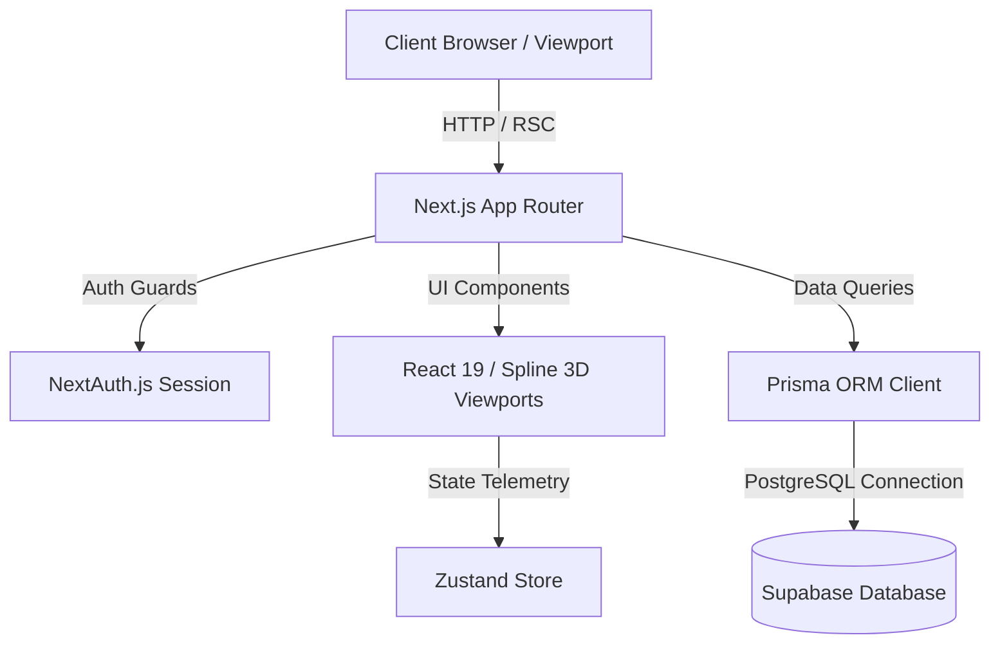

# System Architecture

## Overview
Syncora follows a decoupled, high-performance modular architecture leveraging Next.js App Router for server-first rendering, Zustand for client-side state telemetry, and Prisma ORM for type-safe database transactions.

## Core Layers

1. **Presentation Layer (`/app`, `/components`)**
   - Implements the cinematic graphite aesthetic using custom CSS tokens and Tailwind utility classes.
   - Houses specialized Spline 3D loader wrappers with error boundaries to prevent canvas crashes.

2. **State & Telemetry Layer (`/src/lib`, `/src/store`)**
   - Utilizes Zustand for reactive, low-overhead client state management across goal tracking cards and alignment matrices.

3. **Data Access & Security Layer (`/prisma`, `/src/lib/auth`)**
   - Prisma ORM acts as the single source of truth for database schema definitions and query execution against Supabase.
