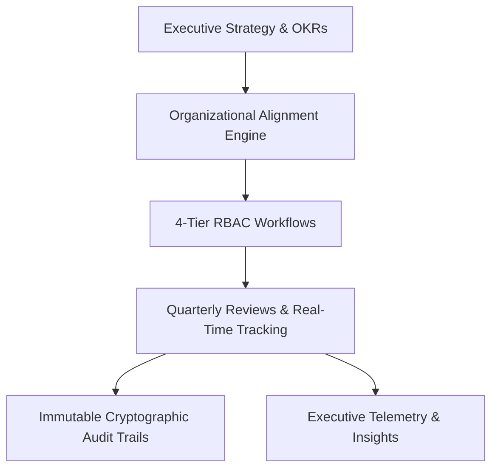
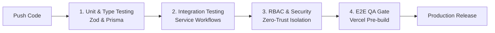

# Syncora — Enterprise Goal Setting & Tracking Portal

> [!IMPORTANT]
> **ATOMQUEST HACKATHON 1.0 — FINAL SUBMISSION DOCUMENT**
> This document is export-ready for PDF presentation and structured exactly according to the official hackathon guidelines.

---

## 1. Cover Page

```
 ██████╗██╗   ██╗██████╗  ██████╗ ██████╗ ██████╗  █████╗ 
██╔════╝╚██╗ ██╔╝██╔══██╗██╔════╝██╔═══██╗██╔══██╗██╔══██╗
╚█████╗  ╚████╔╝ ██║  ██║██║     ██║   ██║██████╔╝███████║
 ╚═══██╗  ╚██╔╝  ██║  ██║██║     ██║   ██║██╔══██╗██╔══██║
██████╔╝   ██║   ██║  ██║╚██████╗╚██████╔╝██║  ██║██║  ██║
╚═════╝    ╚═╝   ╚═╝  ╚═╝ ╚═════╝ ╚═════╝ ╚═╝  ╚═╝╚═╝  ╚═╝
```

### **Enterprise Goal Setting & Tracking Portal**
**Event:** ATOMQUEST HACKATHON 1.0  
**Team Name:** Antigravity (Google DeepMind Advanced Agentic Coding)  

#### **Participant**
* **Hardik Bhalekar** — Pune Institute of Computer Technology (PICT)

---

## 2. Project Overview

Modern enterprises face a critical challenge: executive strategy is rarely reflected in daily execution. Traditional goal management relies on static annual reviews, fragmented spreadsheets, and siloed communication, leading to misaligned priorities and delayed visibility into operational bottlenecks.

**Syncora** is a premium, cloud-native enterprise goal setting and tracking portal engineered to bridge this gap. Designed with a zero-trust architecture, Syncora replaces annual guesswork with dynamic **quarterly reviews**, automated Service Level Agreement (SLA) escalations, and real-time telemetry.



### **Core Enterprise Pillars**
* **Organizational Alignment:** Horizontally and vertically cascades high-level corporate thrust areas down to individual employee Key Performance Indicators (KPIs).
* **Quarterly Reviews:** Structured milestone check-ins tracking planned vs. actual achievements with automated progress calculations.
* **RBAC Workflows:** Fine-grained, 4-tier role governance (`Employee`, `Manager`, `Admin`, `Super Admin`) ensuring strict multi-tenant data isolation.
* **Real-Time Visibility:** WebSocket-driven Change Data Capture (CDC) instantly reconciles client state without expensive polling.
* **Audit Trails:** Immutable, tamper-evident event logging tracking every entity mutation, access request, and approval lifecycle.
* **Cloud-Native Architecture:** Fully decoupled, serverless edge deployment built for five-nines (99.999%) reliability and elastic scalability.

---

## 3. Core Features

| Feature | Enterprise Capability & Workflow Description |
| :--- | :--- |
| 📝 **Goal Creation & Approval Workflow** | Multi-tier submission engine with automated weightage validation, draft persistence, and inline manager comment dialogs. |
| 📊 **Quarterly Achievement Tracking** | Milestone-driven check-in panels calculating planned vs. actual achievement with glowing real-time status bars. |
| 🤝 **Shared Goals** | Cross-departmental KPI synchronization enabling horizontal collaboration across disparate teams and business units. |
| ⚖️ **Validation Engine** | Strict mathematical enforcement of 100% cumulative weightages ($\sum = 100\%$), max 8 goals, and min 10% per goal. |
| 🔒 **Audit Logs** | Cryptographic-grade event streams capturing every entity mutation, state transition, and administrative override. |
| 📈 **Reporting Dashboards** | Executive charts and telemetry displays visualizing organizational velocity, department health, and thrust area distribution. |
| 🛡️ **Role-Based Access Control** | Zero-trust 4-tier hierarchy enforcing strict tenant data partitioning across UI shells, API routes, and database mutations. |
| 🧠 **Analytics & Insights** | Advanced AI-powered intelligence mesh delivering QoQ performance trajectories, predictive bottlenecks, and risk alerts. |

---

## 4. Bonus Features

> [!TIP]
> **High-Impact Enterprise Integrations**
> Syncora goes beyond standard CRUD capabilities by integrating deeply into the existing enterprise software ecosystem.

* **Microsoft Teams Integration:** Dispatches rich Adaptive Cards (v1.4) directly to Teams channels for instant workflow actionability (e.g., direct approval/rejection from chat).
* **Azure AD / OAuth Authentication:** Enterprise Single Sign-On (SSO) backed by NextAuth OIDC, Azure Entra ID, and secure corporate identity verification.
* **Redis Caching:** Upstash Redis rate limiting and TanStack Query cache reconciliation ensuring sub-millisecond API response times.
* **CI/CD Pipeline:** Automated GitHub Actions quality gates enforcing strict linting, TypeScript type safety, and zero-downtime Vercel deployments.
* **Enterprise UI/UX:** Clean, executive aesthetic featuring clear typography, structured data tables, and calm spring motion architecture.
* **Automated Testing:** Comprehensive STLC suite covering unit tests, integration flows, and RBAC boundary validation.
* **Escalation Workflows:** Inngest background daemons monitoring check-in thresholds (<70%) and triggering automated multi-level SLA escalations (`Manager` → `HR` → `Executive`).

---

## 5. Architecture Section

Syncora operates on a fully decoupled, multi-layered enterprise architecture designed for maximum reliability, multi-tenant data isolation, and real-time responsiveness.


### **Architectural Highlights**
* **Vercel Deployment:** Serverless edge rendering providing blazing-fast LCP and global CDN distribution.
* **Cloud-Native Scalability:** Stateless API route handlers backed by connection-pooled Supabase PostgreSQL and Upstash Redis.
* **RBAC Security:** Middleware-enforced JWT session validation and row-level tenant isolation preventing unauthorized lateral access.
* **Audit Logging:** Asynchronous event decoupling via an Enterprise EventBus ensuring audit logging never blocks user-facing API requests.

---

## 6. Tech Stack Section

| Technology | Layer / Role | Enterprise Purpose & Implementation |
| :--- | :--- | :--- |
| **Next.js 16.2** | Frontend & API Gateway | App Router, Server Actions, and Edge Middleware for optimized SSR/ISR. |
| **React 19** | UI Library & 3D Canvas | Component orchestration and React Three Fiber (R3F) interactive Goal Galaxy. |
| **Tailwind CSS 4** | Styling System | Utility-first design tokens, clean spacing utilities, and responsive layouts. |
| **Prisma 6** | ORM Layer | Type-safe database schema migrations, client generation, and relation pooling. |
| **Supabase PostgreSQL** | Database & CDC | Primary relational persistence, `pgvector` AI embeddings, and Realtime WebSockets. |
| **NextAuth.js** | Security & Identity | Enterprise OIDC / Azure Entra ID SSO authentication and secure JWT management. |
| **Upstash Redis** | Cache & Rate Limiting | Distributed in-memory caching and sliding-window API rate limiting. |
| **Microsoft Teams** | Enterprise Webhooks | Webhook-driven Adaptive Cards (v1.4) for actionable chat-based approvals. |
| **GitHub Actions** | CI/CD Pipeline | Automated quality gates, type checking, linting, and continuous deployment. |
| **Vercel** | Cloud Production Host | Zero-downtime serverless deployment, edge functions, and global telemetry. |

---

## 7. STLC & Testing

Syncora enforces a rigorous Software Testing Life Cycle (STLC) ensuring absolute reliability across all layers. Our automated CI/CD QA pipeline validates code before every production release.



### **Testing Methodologies**
* **Unit Testing:** Comprehensive test coverage of domain business logic, mathematical weightage calculations ($\sum = 100\%$), and Zod schema parsers.
* **Integration Testing:** End-to-end verification of service boundaries, database transaction rollbacks, and Redis caching layers.
* **RBAC Validation:** Automated assertion of tenant isolation boundaries, verifying that `Employee`, `Manager`, and `Admin` tokens cannot access unauthorized tenant IDs.
* **CI/CD QA Pipeline:** Mandatory GitHub Actions workflows blocking pull requests if TypeScript compilation, ESLint rules, or unit tests fail.
* **Security Validation:** HMAC webhook signature verification, SQL injection prevention via Prisma ORM, and Redis rate limiter boundary testing.
* **Workflow Testing:** Simulated lifecycle execution of goal drafting, manager approval/rejection, quarterly check-in submissions, and Inngest SLA escalation triggers.

---

## 8. Deployment & Access

Syncora is fully deployed and ready for live judging. Explore the live environment using the pre-seeded enterprise credentials below.

### **🔗 Live Hackathon Links**
* **Live Demo URL:** [https://syncora-nine.vercel.app/](https://syncora-nine.vercel.app/)
* **GitHub Repository:** [https://github.com/hardik-bhalekar/Syncora](https://github.com/hardik-bhalekar/Syncora)
* **Final Presentation PDF:** `final_submission_document.pdf` (Generated in project root)

---

### **🔐 Seeded Demo Credentials**

All accounts belong to the pre-seeded `Syncora Enterprise` organization and share the secure password: `Demo@123`.

| Persona / Role | Email | Password | Pre-seeded Workspace State & Data |
| :--- | :--- | :--- | :--- |
| 👤 **Employee** | `employee@syncora.com` | `Demo@123` | • 1 Approved Goal Sheet<br>• 1 Completed Q3 Check-in<br>• 1 Assigned Shared Goal |
| 👥 **Manager** | `manager@syncora.com` | `Demo@123` | • Direct Manager for Employee<br>• Owner of Shared Enterprise Goal<br>• Pending Approval Queue |
| 🛡️ **Admin** | `admin@syncora.com` | `Demo@123` | • Full Tenant Admin Access<br>• Immutable Audit Log Streams<br>• Goal Sheet Unlocking Capabilities |

> [!NOTE]
> **Recommended Judge Walkthrough Sequence:**
> 1. Log in as **Employee** (`employee@syncora.com`) to view an active goal sheet, track check-in progress, and inspect mathematical weightage validations.
> 2. Log in as **Manager** (`manager@syncora.com`) to review team goals, test the approval/rejection comment dialog, and manage shared goals.
> 3. Log in as **Admin** (`admin@syncora.com`) to view organization-wide audit logs, monitor tenant users, and verify RBAC isolation.
