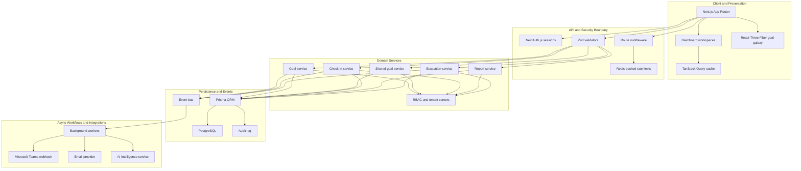

# System Architecture

Syncora is structured as a layered Next.js application with clear boundaries between presentation, API validation, authorization, domain services, persistence, and asynchronous workflow processing.

## Notes

- Tenant isolation is enforced in service-layer access patterns and RBAC checks before mutations are committed.
- Goal submission rules are validated server-side: total weightage, minimum per-goal weightage, and maximum goals per sheet.
- Background workflow processing is decoupled from user-facing requests through event dispatch and worker functions.
- Audit logging records sensitive workflow transitions such as approvals, rejections, unlocks, and administrative actions.
